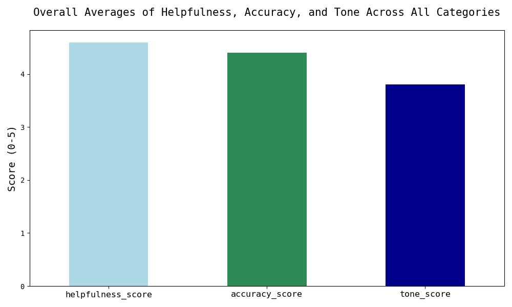
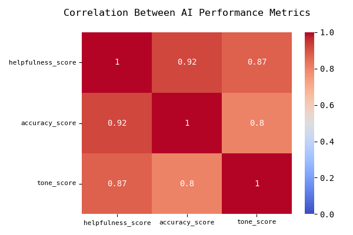

# README
This project simulates a real-world AI Operations task: evaluating and refining customer-facing chatbot responses to improve customer experience.

Using a manually scored dataset (with 15 common support queries) AI performance was assessed on 3 key dimensions: helpfulness, accuracy, and tone. Trends were analyzed across categories like billing, account issues, tech support, etc.

# Key Insights and Recommendations

### Key Insights

#### 

- Helpfulness scores were consistently high across all categories. It shows that the chatbot provided useful information for the user in almost all cases.

- Accuracy scores were also consistently high, which shows that the chatbot gave factually correct responses in most cases.

- Tone scores were slightly lower, especially in urgent cases like when the user has to reset their password or is locked out of their account. This suggests that this AI lacks human-like/empathetic phrasing when it comes to emotionally charged queries.

- There is a stong correlation between accuracy and helpfulness scores which is predictable.

- There is a high correlation between helpfulness and tone scores which implies that the tone has a direct impact on whether the user feels satisfied/assisted (even if the information is accurate --- this is seen by the slightly weaker correlation between accuracy and tone).

### Recommendations

- Improve prompt design for support and urgent-use cases with more human-like/empathetic language like "I'm sorry to hear that...", "Let me help you right away", etc.

- Train the chatbot to recognize when a customer is upset and respond in a more empathetic tone, essentially implementing a tone refinement layer for emotionally sensitive queries.

- Evaluate chatbot performance using this framework as a routine to fine-tune responses and monitor improvements over time.
