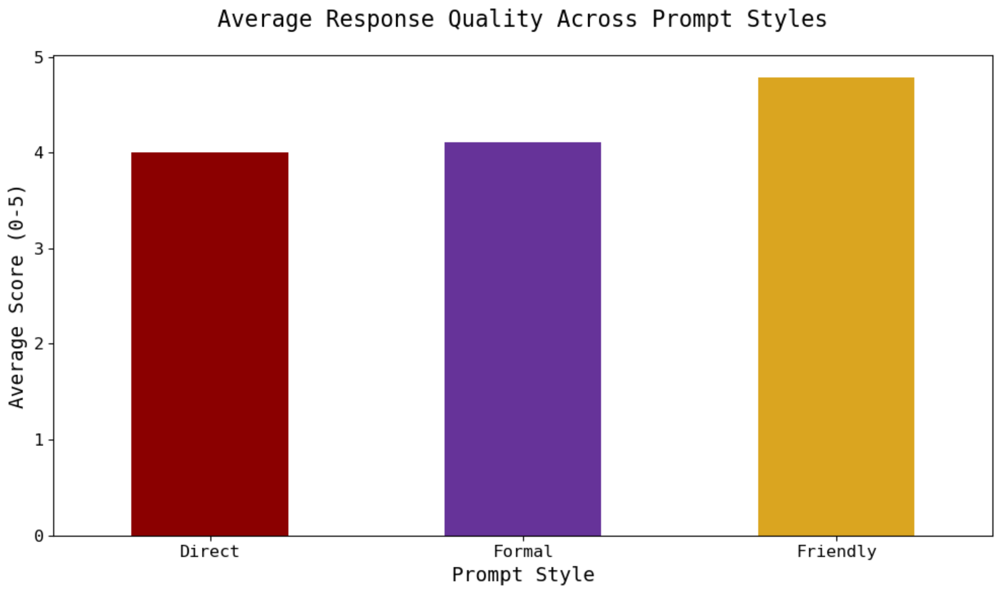
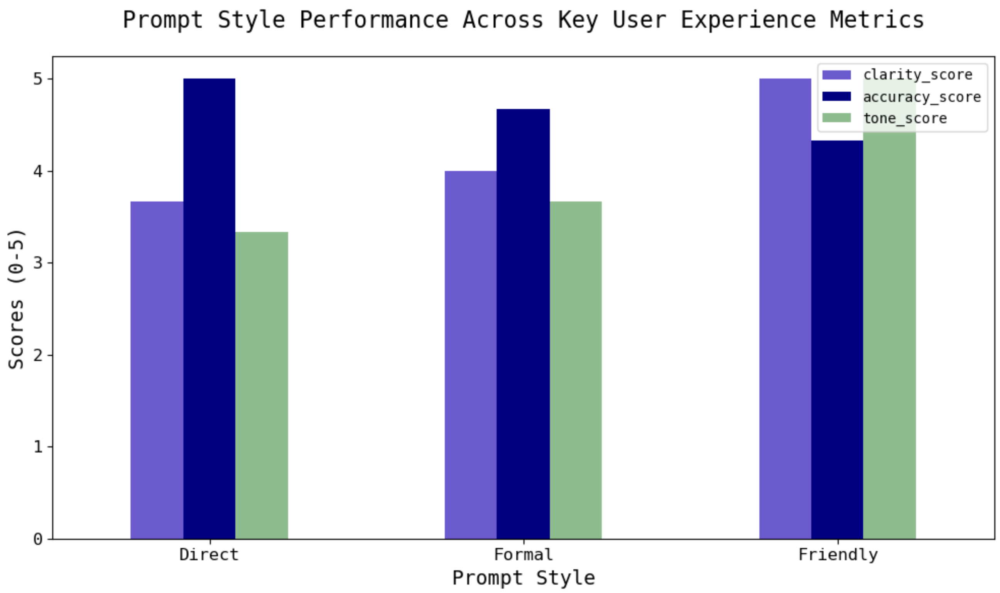
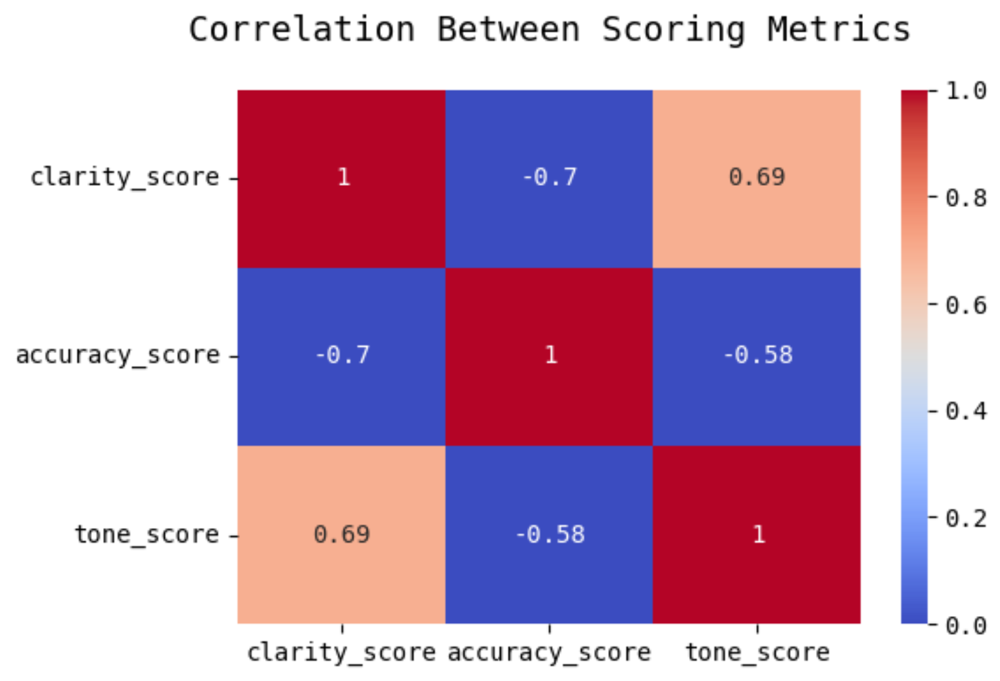

## 📑 Prompt Engineering Audit: A Case Study in AI Response Optimization

This project explores how different prompt styles influence the quality of AI-generated responses in a legal support context. Inspired by the Analyst, AI Operations role at Clio, it simulates a real-world task of evaluating AI tools to improve customer experience.

I tested three common legal support questions using three distinct prompt styles — Direct, Formal, and Friendly — and analyzed the resulting responses based on accuracy, tone, and clarity. The goal was to identify tradeoffs between response readability and legal precision, and to recommend prompt strategies that balance empathy, usefulness, and compliance.

### ✒️ Scoring Criteria

Each AI response was rated on a scale of 0–5 across three dimensions:

🔎 **Clarity**
- 5 – Very clear, concise, and easy to understand for non-experts
- 3 – Understandable with some effort; slightly long-winded or awkward
- 1 – Confusing, dense, or filled with legal jargon

🎯 **Accuracy**
- 5 – Fully accurate, complete, and legally precise
- 3 – Mostly accurate but missing key steps or context
- 1 – Vague, incomplete, or partially incorrect

🎊 **Tone**
- 5 – Empathetic, professional, and user-friendly
- 3 – Neutral or robotic but acceptable
- 1 – Cold, overly formal, or not appropriate for customer-facing contexts

## 📊 Insights

- The Friendly prompt style achieved the highest overall perfomance across clarity, accuracy, and tone, while the Direct prompt style scored the lowest.

Let's dive further into these performances...
  

- This graph suggests that the clarity and tone of AI responses have a positive correlation, which means that more empathetic/human-sounding responses tend to be easier to read through and understand.
- Both clarity and accuracy, as well as tone and accuracy, are negatively correlated, which indicates that legally precise answers may lower readability and warmth.

I created a heatmap of the correlation matrix to validate the above relationships analytically.

The heatmap confirms:
- A moderate positive correlation between clarity and tone
  - More empathetic responses are easier to read
- A strong negative correlation between tone and accuracy
  - Friendlier language tends to be less legally precise
- A very strong negative correlation between clarity and accuracy
  - Simpler responses tend to lack key legal details

These insights highlight the importance of thoughtful prompt design in GenAI for customer-facing environments.
